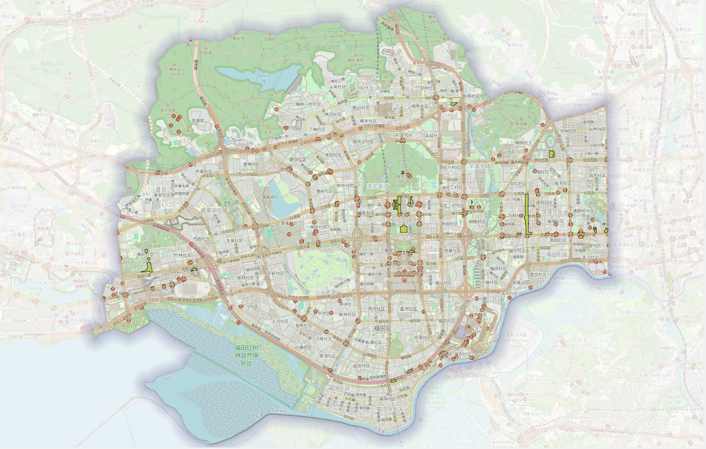

## 背景

之后的项目走向大概是：

Taxi GPS - Map Matching - Road Level traffic State

Rainfall + DEM +SAR - Flood Disturbance State

Road Topology + Normal Traffic Dependency + Disaster Disturbance

\- Dynamic Spatiotemporal Graph - Traffic Forecasting Under Extreme Weather

## 核心内容

目前的工作聚焦于Taxi GPS - Map Matching - Road Level Traffic State

- 时间窗口的对齐

GPS数据聚焦于2019年的某日，所以路网也必须是2019年的路网。直接从OSM获得的路网明显不满足该条件

- GPS数据的清洗

- 路网匹配的具体操作

## 具体步骤

首先找到当时的路网信息，这是基础中的基础。

进行Overpass查询

``` {#FutianArea .Overpass}
[out:xml][timeout:300][date:"2019-09-30T15:59:59Z"];

// 1. 获取下载框内的全部 highway ways。
// 顺序：南纬度、西经度、北纬度、东经度。
// 此处不按道路等级、限速是否填写或单行标签是否填写筛选。
way["highway"](22.48,113.96,22.63,114.13)->.roads;

// 2. 获取上述道路的全部节点，包括位于下载框之外的成员节点。
node(w.roads)->.road_nodes;

// 3. 获取以这些道路或道路节点为成员的转向限制关系。
// 不再次用下载框截断关系，以保留边缘道路涉及的限制。
(
  rel(bw.roads)["type"~"^restriction(:.*)?$"];
  rel(bn.road_nodes)["type"~"^restriction(:.*)?$"];
)->.restrictions;

// 4. 补充框内交通控制和障碍节点。
// 已经属于道路的节点也会出现，但集合会自动去重。
(
  node["highway"~"^(traffic_signals|stop|give_way)$"]
      (22.48,113.96,22.63,114.13);
  node["barrier"](22.48,113.96,22.63,114.13);
)->.control_nodes;

// 5. 合并道路、节点和限制关系。
(
  .roads;
  .road_nodes;
  .restrictions;
  .control_nodes;
);

// 6. 递归补齐关系成员、成员道路及其节点，保留原集合。
(
  ._;
  >>;
);

// 7. 输出完整对象、全部已有标签及版本元数据。
out meta;
```

``` {#FutianRevised .Overpass}
[out:xml][timeout:600][date:"2019-09-30T15:59:59Z"];

/*
福田区及周边下载框
顺序：南纬度，西经度，北纬度，东经度
范围大于福田行政边界，用于保留边缘道路连接。
*/

// 1. 获取全部 highway way。
// 本阶段不按道路等级、oneway、maxspeed 或 access 完整程度筛选。
way
  ["highway"]
  (22.48,113.96,22.63,114.13)
  ->.roads;

// 2. 获取每条道路的全部原始节点。
node(w.roads)->.road_nodes;

// 3. 获取与道路或道路节点相关的转向限制关系。
// 包括 type=restriction 及 restriction:* 类型。
(
  rel(bw.roads)
    ["type"~"^restriction(:.*)?$"];

  rel(bn.road_nodes)
    ["type"~"^restriction(:.*)?$"];
)->.restrictions;

// 4. 补充研究区内交通控制与道路障碍节点。
(
  node
    ["highway"~"^(traffic_signals|stop|give_way|mini_roundabout|motorway_junction)$"]
    (22.48,113.96,22.63,114.13);

  node
    ["barrier"]
    (22.48,113.96,22.63,114.13);
)->.control_nodes;

// 5. 合并原始道路、道路节点、限制关系和控制节点。
(
  .roads;
  .road_nodes;
  .restrictions;
  .control_nodes;
)->.selected;

// 6. 递归补齐 relation 成员、成员 way 及其节点。
// 边界附近的限制关系可能引用下载框外的短道路，因此不再次裁框。
.selected >> ->.members;

(
  .selected;
  .members;
);

// 7. 输出全部已有标签以及版本、时间和 changeset 元数据。
out meta;
```

查询结果如下图：

## 结论与思考

- 得到了什么结论？
- 证据是否充分？
- 下一步准备做什么？